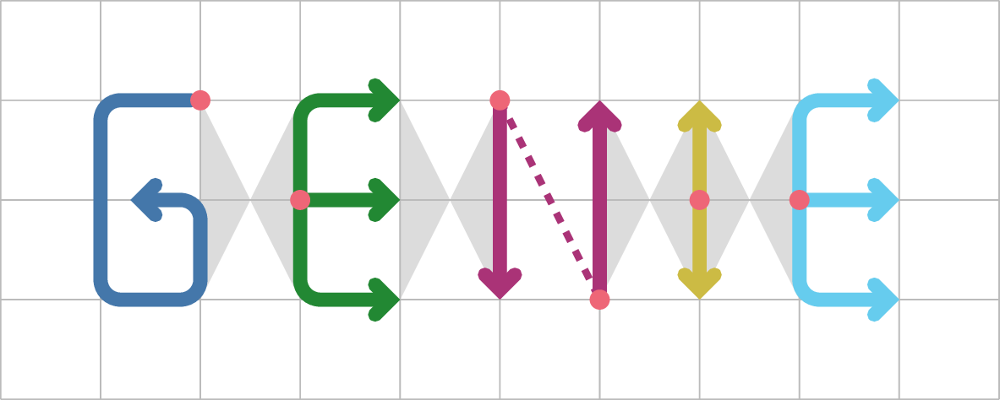

# GENIE - Gauge-Equivariant Non-local Information Exchange
We present a neural network architecture to use as a preconditioner for the Dirac equation in Lattice QCD.
Our architecture is gauge-equivariant by construction, reducing the training cost drastically.
By using a network architecture that explicitly encourages non-local information exchange, our architecture is able to beat critical slowing down by addressing both topological as well as non-topological modes of the Dirac operator.
This architecture thus opens up a possible path back to geometric multigrid for lattice QCD.
